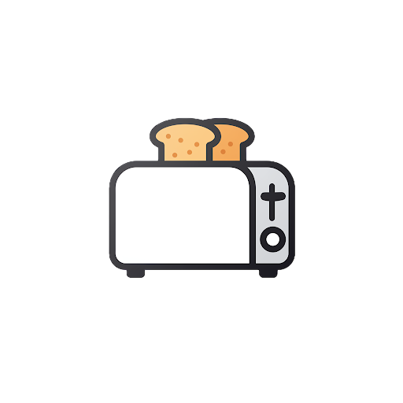
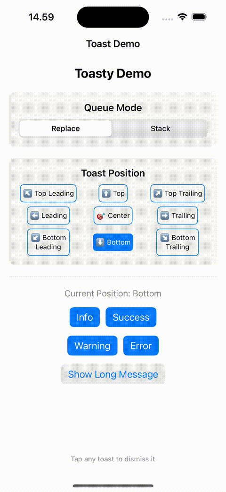
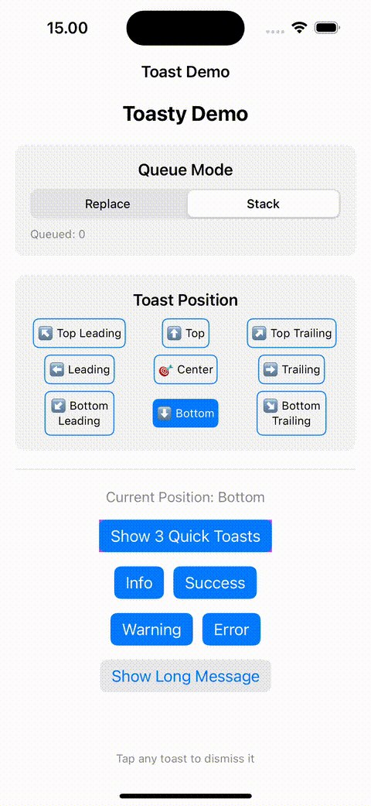

<p align="center">
    
</p>

<h1 align="center">Toasty</h1>

<p align="center">
    <a href="https://swift.org">
        
    </a>
    <a href="https://developer.apple.com/ios/">
        
    </a>
    <a href="https://developer.apple.com/macos/">
        
    </a>
    <a href="https://github.com/yourusername/Toasty/blob/main/LICENSE">
        
    </a>
</p>

<p align="center">
    A lightweight, customizable toast notification library for SwiftUI applications, 
    designed to provide elegant and user-friendly toast with minimal setup.
</p>

<p align="center">
    
    
</p>

## ✨ Features

- 🎯 Simple and intuitive API
- 🎨 Four built-in toast types (info, success, warning, error)
- ⚡️ Smooth animations and transitions
- 🔄 Auto-dismissal with customizable duration
- 👆 Tap to dismiss
- ♿️ Enhanced accessibility support with VoiceOver announcements
- 📱 Safe area aware
- 🎭 Flexible positioning (top, bottom, center, leading, trailing with variants)
- 🛡️ Race condition protection for rapid toast calls
- ✅ Input validation for empty messages and invalid durations
- 🎨 Customizable appearance through configuration
- 🧪 Comprehensive test coverage
- 📋 Queue system - stack toasts or replace them (configurable)

## 📦 Installation

### Swift Package Manager

Add the following to your `Package.swift` file:

```swift
dependencies: [
    .package(url: "https://github.com/annurdien/Toasty.git", from: "1.0.0")
]
```

## 🚀 Usage

### Basic Setup

1. Add the `.toastable()` modifier to your root view:

```swift
import Toasty

@main
struct MyApp: App {
    var body: some Scene {
        WindowGroup {
            ContentView()
                .toastable() // Add this modifier
        }
    }
}
```

### Show Toasts

You can use the `@Toast` property wrapper (recommended) or `@EnvironmentObject`:

```swift
struct ContentView: View {
    @Toast private var toast
    
    var body: some View {
        Button("Show Toast") {
            // Simple usage
            toast.show(message: "Hello, World!")
            
            // With type and duration
            toast.show(
                message: "Operation successful!",
                type: .success,
                duration: 3.0
            )
            
            // Using ToastData
            let customToast = ToastData(
                message: "Custom toast",
                type: .warning,
                duration: 2.0
            )
            toast.show(toast: customToast)
        }
    }
}
```

### Toast Types

- `.info` - For general information
- `.success` - For successful operations
- `.warning` - For warning messages
- `.error` - For error messages

### Customization

#### Position
Adjust toast position using the alignment parameter:

```swift
// Basic positions
ContentView()
    .toastable(alignment: .top)    // Top center
    .toastable(alignment: .bottom) // Bottom center
    .toastable(alignment: .center) // Screen center

// Corner positions  
ContentView()
    .toastable(alignment: .topLeading)    // Top left
    .toastable(alignment: .topTrailing)   // Top right
    .toastable(alignment: .bottomLeading) // Bottom left
    .toastable(alignment: .bottomTrailing)// Bottom right

// Side positions
ContentView()
    .toastable(alignment: .leading)  // Left center
    .toastable(alignment: .trailing) // Right center
```

#### Appearance
Customize toast appearance using `ToastConfiguration`:

```swift
import Toasty

// Create custom configuration
var customConfig = ToastConfiguration()
customConfig.cornerRadius = 15
customConfig.shadowRadius = 8
customConfig.messageFont = .title3
customConfig.maxLines = 5

// Apply to your view
ContentView()
    .toastable()
    .toastConfiguration(customConfig)
```

### Advanced Usage

#### Check Toast State
```swift
@Toast private var toast

var body: some View {
    VStack {
        if toast.isShowingToast {
            Button("Dismiss Current Toast") {
                toast.dismiss()
            }
        }
        
        Button("Show Toast") {
            toast.show(message: "Hello!")
        }
    }
}
```

#### Toast Queue System

By default, new toasts replace currently shown ones. You can enable queue mode to stack multiple toasts:

```swift
// Enable queue mode - toasts will be shown one after another
ContentView()
    .toastable(alignment: .top, queueMode: .queue)

// Default replace mode - new toasts replace current ones  
ContentView()
    .toastable(alignment: .top, queueMode: .replace)
```

**Queue Management:**
```swift
@Toast private var toast

// Show multiple toasts - they'll queue up in queue mode
toast.show(message: "First toast", type: .info)
toast.show(message: "Second toast", type: .success) 
toast.show(message: "Third toast", type: .warning)

// Check queue status
if toast.hasQueuedToasts {
    print("There are \(toast.queueCount) toasts in queue")
}

// Dismiss current toast (next will show automatically in queue mode)
toast.dismiss()

// Clear entire queue and current toast
toast.dismissAll()
```

**Example with Queue Controls:**
```swift
struct QueueExampleView: View {
    @Toast private var toast
    @State private var queueMode: ToastQueueMode = .replace
    
    var body: some View {
        VStack(spacing: 20) {
            Picker("Mode", selection: $queueMode) {
                Text("Replace").tag(ToastQueueMode.replace)
                Text("Queue").tag(ToastQueueMode.queue)
            }
            .pickerStyle(SegmentedPickerStyle())
            
            Button("Show 3 Quick Toasts") {
                toast.show(message: "First toast 🥇", type: .info)
                toast.show(message: "Second toast 🥈", type: .success)
                toast.show(message: "Third toast 🥉", type: .warning)
            }
            
            if toast.hasQueuedToasts {
                Text("Queue: \(toast.queueCount) toasts")
                    .foregroundColor(.secondary)
                
                Button("Clear Queue") {
                    toast.dismissAll()
                }
                .foregroundColor(.red)
            }
        }
        .toastable(alignment: .top, queueMode: queueMode)
    }
}
```

**Queue Mode Guidelines:**
- **Use `.replace` for**: Status updates, progress notifications, real-time data
- **Use `.queue` for**: Multiple user actions, batch operations, step-by-step feedback

#### Input Validation
The library automatically validates inputs:
- Empty or whitespace-only messages are ignored
- Duration is clamped between 0.5 and 10.0 seconds
- Race conditions are handled automatically

### Accessibility

Toasty includes comprehensive accessibility support:
- VoiceOver announcements when toasts appear
- Proper accessibility labels and traits
- Voice Control support with "Dismiss" action
- Screen Reader optimized content structure

## ⚙️ Requirements

- iOS 15.0+
- macOS 12.0+
- Xcode 15.0+
- Swift 5.5+

## 👥 Contributing

We welcome contributions! Please follow these steps:

1. Fork the repository
2. Create your feature branch (`git checkout -b feature/amazing-feature`)
3. Write tests for your changes
4. Commit your changes (`git commit -m 'Add amazing feature'`)
5. Push to the branch (`git push origin feature/amazing-feature`)
6. Open a Pull Request

For major changes, please open an issue first to discuss what you would like to change.

## 📄 License

This project is licensed under the MIT License - see the [LICENSE](LICENSE) file for details.

## 👨‍💻 Author

**Annurdien Rasyid**
- GitHub: [@annurdien](https://github.com/annurdien)
- LinkedIn: [Annurdien Rasyid](https://www.linkedin.com/in/annurdien)
---

<p align="center">
    Made with ❤️ by <a href="https://github.com/annurdien">Annurdien Rasyid</a>
</p>